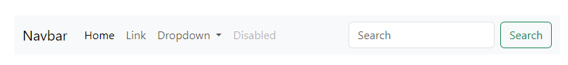
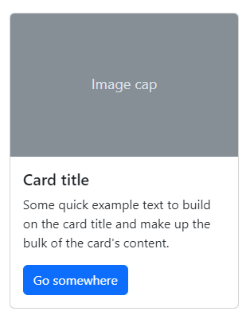

## Bootstrap

Es un popular framework front-end que proporciona herramientas y componentes predefinidos para el desarrollo web responsivo.

## Los componentes que se han utilizado en este proyecto, son los siguientes:

    1. Navbar: Se utilizó el siguiente modelo, modificando algunos textos.
    

   
    2. Cards: Se usó el modelo de card con imagen .

   
    3. Footer: Se realizó un footer sencillo usando las clases de "container", "text center" y "text muted" de bootstrap, este último para aplicar un color de texto gris claro.

